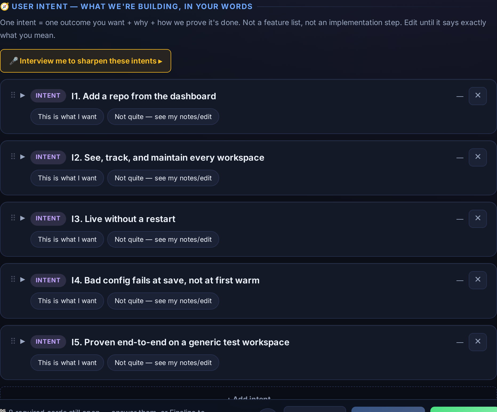
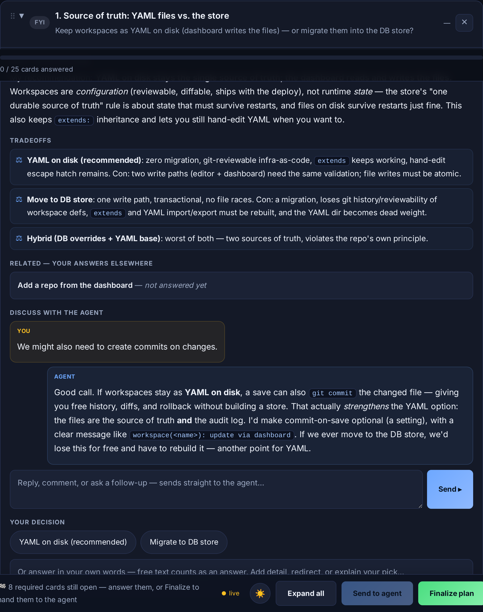
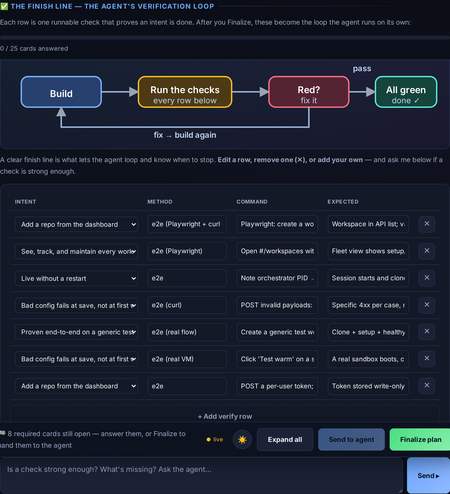

<!-- experiment-banner:start -->
> 🧪 **This is an experiment** — part of [**AI Will Replace You**](https://doryzidon.com).
>
> **Stop wasting time on AI. I run practical experiments — real lessons you can use tomorrow, biweekly.**
>
> ▶ **[Watch the demo on YouTube](https://youtu.be/cFwvulWoTE4)** · 📖 **[Read the write-up](https://doryzidon.com/blog/stop-approving-plans-you-didnt-read)** · ✉️ **[Subscribe to the newsletter](https://www.linkedin.com/build-relation/newsletter-follow?entityUrn=7453650303100383232)**
>
> More on [@aiwillreplaceyou](https://youtube.com/@aiwillreplaceyou)
<!-- experiment-banner:end -->

# plan-html

**Interactive decision-deck planning.** Turn a `plan.json` into a live HTML deck
you work through in the browser — intent cards, decision cards, boundaries,
implementation steps and a final-verify "finish line" — answered with buttons
or your own words, iterated in rounds until you finalize. Every answer
autosaves, so an interrupted session loses nothing.

It pairs with an agent: the agent writes the `plan.json`, serves it, and answers
your questions live; you reshape the plan in the browser (add/edit/strike cards,
reorder, ask, grill). The deck is the review surface — not a wall of markdown in
a terminal.



| | |
|---|---|
|  |  |
| _A decision card: options, tradeoffs, and a live back-and-forth with the agent right inside the card._ | _The finish line: a verification loop and the acceptance criteria that prove the plan is done._ |

## Features

- **Reshapeable** — add, edit, strike and drag-reorder cards, steps, and finish-line rows; your changes are authoritative and ride back to the agent.
- **Live answers** — ask a card a question and the agent's reply streams back into it (SSE), with the answer written into the plan so it survives a dropped connection.
- **Works remotely** — serve on your LAN or behind a tunnel; an adaptive polling fallback keeps updates flowing even through proxies that buffer SSE.
- **Finalize on your terms** — finalize early and let the agent decide what's unanswered (with a confirm), or loop until everything's pinned.
- **Autosaves everything** — every answer is persisted next to the plan; an interrupted session loses nothing.
- **Zero dependencies to run** — stdlib Python server, single offline `deck.html`. No build step, no CDN.

## What's here

| Path | What it is |
|------|------------|
| `serve_plan.py` | The server. Renders `plan.json` into the deck, serves it on `127.0.0.1`, autosaves answers, streams plan changes over SSE (`--live`), and prints each round to stdout. Zero dependencies (stdlib only). |
| `templates/deck.html` | The deck — a single self-contained, offline HTML file, hand-edited. Its JavaScript is organized into a few labeled top-level `<script>` blocks that run in document order and share one global scope. No build step, no modules, no CDN. |
| `scripts/lint-deck.js` | Extracts the deck's inline `<script>` blocks into a temp file and runs ESLint over them. |
| `tests/` | `tests/e2e` (pytest HTTP + Playwright browser). |

## Quick start

```bash
# serve a plan (no Node needed to run — the deck is a single offline HTML file)
python3 serve_plan.py --plan /abs/path/to/plan.json --live
```

The deck opens in your browser. Work through the cards; answers autosave to
`answers.json` next to the plan. Click **Send to agent** to ship a round, or
**Finalize** when you're done.

### Phone / remote access

```bash
python3 serve_plan.py --plan plan.json --host 0.0.0.0   # LAN
# or expose a running deck publicly with a tunnel:
cloudflared tunnel --url http://localhost:<port>
```

Live updates use SSE, with an automatic polling fallback for environments that
buffer event streams (Cloudflare quick-tunnels do this) — so the deck stays in
sync over a tunnel even when the live push can't get through. Pass a fixed
`--port` when tunnelling so the public URL survives a server restart.

## Develop

The deck is a single hand-edited offline HTML file (no CDN, opens with
`file://`). Edit `templates/deck.html` directly — its JavaScript lives in a few
labeled top-level `<script>` blocks (markdown/dom helpers, state, cards,
sections, live + main entry) that run in document order and share one global
scope. There is no build step.

```bash
npm install
npm run lint         # eslint over the deck's inline JS (extracted)
npm run test:e2e     # Playwright browser e2e (needs Chromium)
npm test             # lint + Playwright e2e
```

```bash
# Python server tests
pip install -e ".[test]"
pytest               # HTTP e2e + unit
```

CI runs lint and the Python suite on every push; the Playwright suite runs when
a browser is available.

## License

MIT © Dory Zidon
